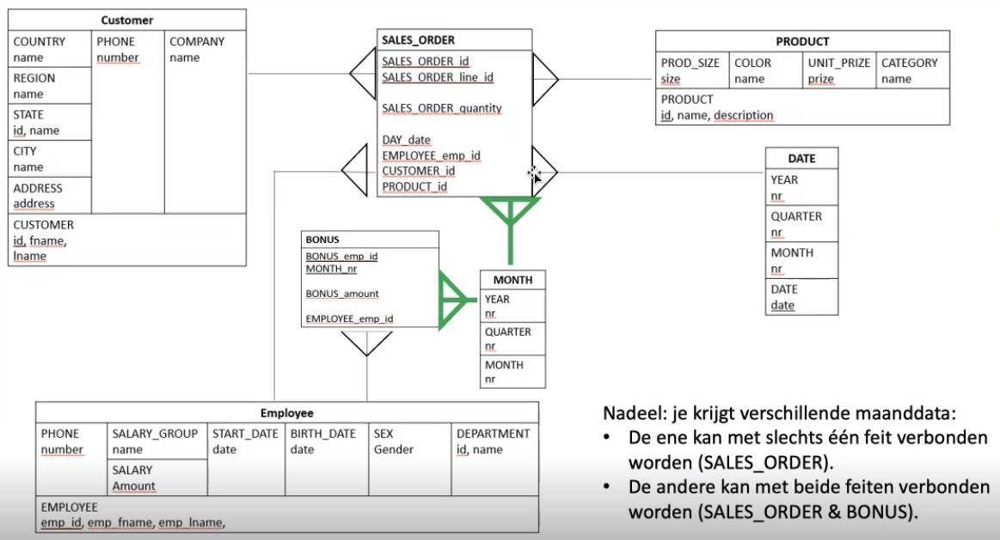

# Sterschema
Feiten tabel in het midden, een feit is namelijk een gebeurtenis. Deze moet aan dimensies worden verbonden. Dimensies zijn in het blauw, en een feit is in het groen.

Een feit staat aan de veel kant van een relatie. Een dimensie aan de 1-kant.

# Weet/ken je
- Dat er in feit-brontabellen verborgen dimensies kunnen zitten die je extra moet modelleren

    - Jaar, maand, week, dag moet je mogelijk extra modelleren

- Welke 2 oplossingen er zijn als je een feit tabel met slechts een deel van een dimensietabel wilt verbinden
- Wat het verschil is tussen een meet- en een dimensiewaarde

# Wat kan je
- Feit-brontabellen omzetten naar feittabellen
- Volledige sterschema's maken
- De juiste keuzes maken omtrent de plaatsing van numerieke data in j e sterschema (als meet- en of dimensiewaarde?)

# Feiten herkennen in een brongegevensmodel
Het laagste niveau is een feit. Daarbij geeft Kadir als voorbeeld dat je de 1-op-veel relaties naar de veel-kant volgt en waar je uitkomt, dat is je feit.

- `sales_order_item` is een feit, want het is een tussentabel. Er wijzen 2 of meer veel-kanten naartoe.
- `bonus` is een feit, want zodra we de verborgen tijdsdimensie hebben toegevoegd, is het een tussentabel geworden en wijzen er 2 of meer veel-kanten naartoe.
- `sales_order` is een feit, want het is een tussentabel. Er wijzen 2 of meer veel-kanten naartoe.

Een feit is dus een tabel die 2 of meer veel-kanten naar zich toe heeft.

# Verborgen tijdsdimensie
Een datum of tijd is altijd een dimensie. Dus de `bonus_date` en `order_date` zijn dus dimensies, ook al zijn `bonus` en `sales_order` allebei feiten.

De tijdsdimensie kunnen we weergeven als volgt:

<table>
    <tr>
        <td>DATE</td>
    </tr>
    <tr>
        <td>YEAR nr</td>
    </tr>
    <tr>
        <td>QUARTER nr</td>
    </tr>
    <tr>
        <td>MONTH nr</td>
    </tr>
    <tr>
        <td>DATE date</td>
    </tr>
</table>

# Bonus: van bron- naar feittabel
Doordat we de datum nu als dimensie hebben, komt er een 1-op-veel relatie van date naar `bonus`. Er was al een 1-op-veel relatie van `employee` naar `bonus`, dus nu is `bonus` een koppel-tabel geworden. En dus een feit.

# Sales_order: van bron- naar feittabel
<table>
    <tr>
        <td>SALES_ORDER</td>
    </tr>
    </tr>
        <td>-id -order_date -cust_id -sales_rep</td>
    </tr>
</tabel>

<table>
    <tr>
        <td>SALES_ORDER_ITEM</td>
    </tr>
    <tr>
        <td>-id -line_id -prod_id -quantity
    </tr>
</table>

`sales_order` zit aan de 1 kant (`1`) van de relatie, en `sales_order_item` aan de veel-kant (`1..*`).

In een ster-diagram voegen we deze tabellen samen:

<table>
    <tr>
        <td>SALES_ORDER</td>
    </tr>
    <tr>
        <td>
            SALES_ORDER_id 
            SALES_ORDER_line_id 
            SALES_ORDER_quantity 
            DAY_date 
            EMPLOYEE_emp_id 
            CUSTOMER_id 
            PRODUCT_id
        </td>
        <td>
            &lt;- Hier begint de primaire sleutel (2 kolommen)  
            &lt;- Hier beginnen de meetwaardes (1 kolom) 
            &lt;- Hier beginnen de vreemde sleutels (4 kolommen)    
        </td>
    </tr>
</table>

Hier worden 2 feiten samengevoegd tot 1 tabel, dus noemen we het een geaggregeerd feit.

Meetwaardes komen **altijd** in de feitentabel. De meetwaardes komen altijd **alleen** in de feitentabel, niet in dimensie-tabellen dus. Je kan een kolom toevoegen die niet in de brondata zit.

Het sterschema ziet er dus als volgt uit:

Maar, stel `bonus` heeft geen volledige `date`, maar bijvoorbeeld alleen een maand, dan is de relatie tussen `bonus` en `date` niet toegestaan op deze manier. Dan moeten we de `maand` uit de `date` halen een een aparte relatie daarvan maken:

Je wil in principe niet een dimensie naar een andere dimensie laten wijzen.

Daarna gingen we een video kijken uit [deze playlist](https://www.youtube.com/playlist?list=PLT1UBlxXIqEkvSX5J3Xa_magH71WQqIzu).

Om precies te zijn [nummer 5](https://www.youtube.com/watch?v=zKaUZkHoW6c&list=PLT1UBlxXIqEkvSX5J3Xa_magH71WQqIzu&index=5).
